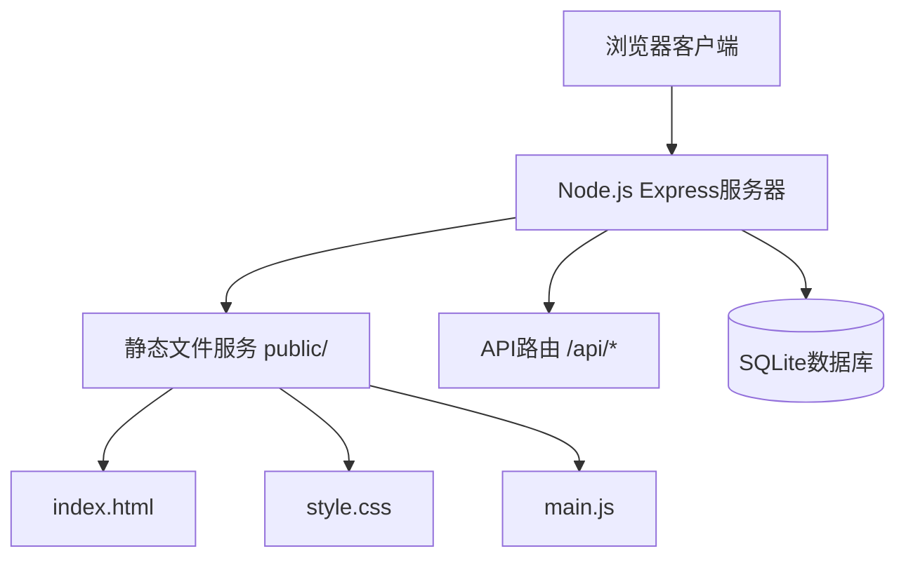
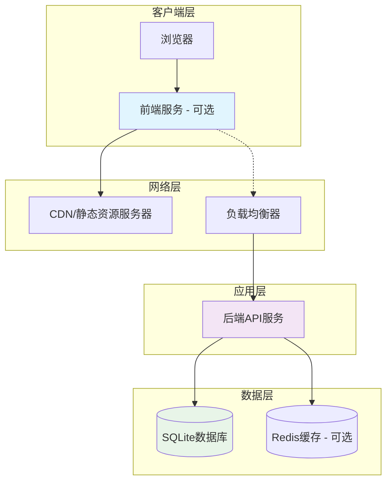
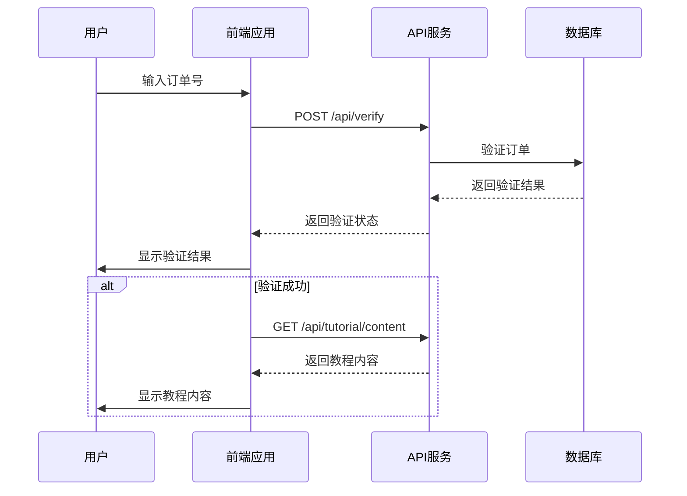
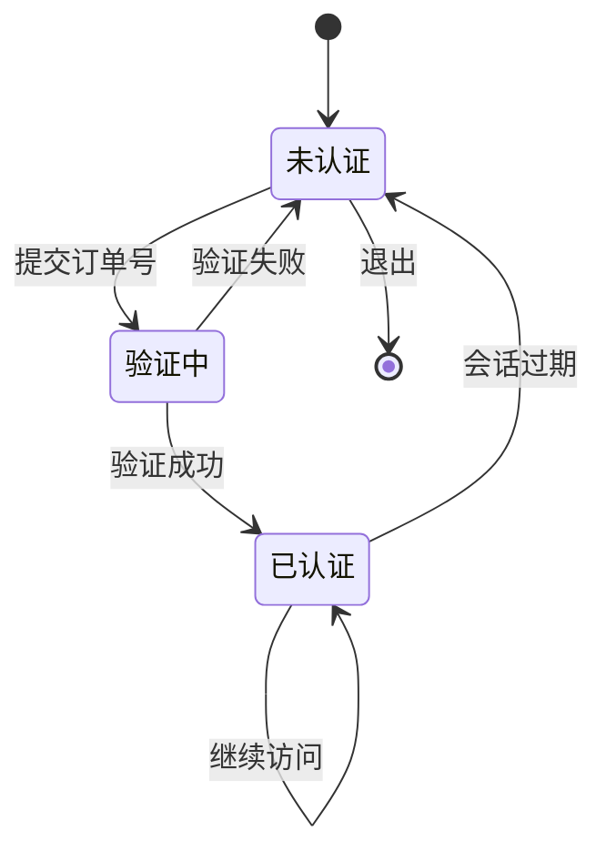
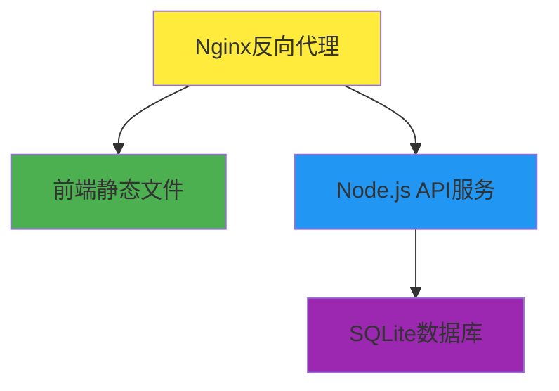
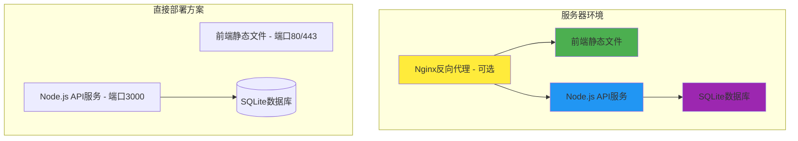

# 前后端分离架构设计

## 架构演变路径

### 当前架构 (单体模式)


**问题分析**:
- 静态文件和API混合在同一服务器进程
- 前端无法独立开发和部署
- 难以进行性能优化和扩展

### 目标架构 (分离模式)


## 技术选型分析

### 后端架构保持
- **框架**: 继续使用 Express.js (降低迁移风险)
- **数据库**: SQLite + sqlite3 (标准npm包，保持轻量级特性)
- **API设计**: RESTful + JSON (标准化接口)
- **安全**: 保持现有安全中间件 (helmet, cors, rate-limit)

### 前端技术选择

#### 方案: 原生JavaScript简单实现 (唯一选择)
**优势**:
- 零学习成本，基于现有技术栈
- 保持现有代码基础，增量改造
- 无需额外构建工具和依赖
- 符合项目轻量级设计理念

**实现**:
- 使用简单直接的JavaScript
- fetch API进行数据交互
- 基本的页面切换逻辑
- 简单的状态管理

**理由**: 最简单直接的实现，无任何复杂概念，纯原生技术。

## 接口设计

### 现有API保持兼容
```javascript
// 订单验证
POST /api/verify
{
  "orderNumber": "P123456789"
}
Response: {
  "success": true/false,
  "message": "验证成功/失败消息",
  "data": { ... } // 成功时返回相关数据
}

// 多次订单管理
POST /api/multi/add
{
  "orderNumber": "P123456789",
  "maxUses": 5
}
```

### 新增前端专用API
```javascript
// 获取教程内容 (验证后)
GET /api/tutorial/content
Response: {
  "success": true,
  "data": {
    "title": "Apple ID 登录教程",
    "sections": [...]
  }
}

// 检查会话状态
GET /api/session/status
Response: {
  "success": true,
  "data": {
    "authenticated": true/false,
    "expiresAt": "2024-01-01T12:00:00Z"
  }
}
```

## 数据流设计

### 认证流程


### 会话管理


## 部署架构

### 单机部署 (过渡方案)


### 简单部署方案 (推荐)


**部署选项**:
1. **简单部署**: 前端静态文件 + Node.js API服务（保持现有方式）
2. **Nginx代理**: 使用Nginx作为反向代理（可选）
3. **CDN加速**: 前端静态文件使用CDN（可选）

## 迁移策略

### 阶段1: API增强 (1-2天)
- 保持现有服务器架构
- 增强现有API返回更多前端需要的数据
- 添加CORS支持
- 测试API兼容性

### 阶段2: 前端改造 (3-5天)
- 改造现有HTML/JS使用API调用
- 使用fetch API调用后端接口
- 实现简单的页面切换逻辑
- 保持现有UI/UX体验

### 阶段3: 服务器简化 (1天)
- 移除静态文件服务中间件
- 简化路由配置
- 更新部署文档

### 阶段4: 部署优化 (1-2天)
- 配置Nginx反向代理
- 设置CDN加速
- 更新监控和日志

## 风险缓解措施

### 技术风险
- **回滚计划**: 保持现有代码分支，确保可快速回滚
- **渐进迁移**: 分阶段实施，每个阶段都可独立验证
- **兼容性测试**: 充分测试API变更的向后兼容性

### 业务风险
- **功能验证**: 每个阶段都进行完整的功能测试
- **性能监控**: 监控迁移过程中的性能指标
- **用户体验**: 保持现有用户界面和交互流程

### 运维风险
- **文档更新**: 及时更新部署和运维文档
- **监控告警**: 设置适当的监控和告警机制
- **备份策略**: 确保数据和配置的备份策略

## 成功指标

### 技术指标
- API响应时间 < 200ms
- 前端页面加载时间 < 2s
- 系统可用性 > 99.9%
- 代码可维护性提升 (圈复杂度降低)

### 业务指标
- 用户验证成功率保持不变
- 用户体验无明显退化
- 开发效率提升 (前后端可并行开发)
- 部署灵活性提升 (支持独立部署)

这个设计方案在保持系统稳定性的前提下，实现了前后端分离的目标，为后续的功能扩展和技术升级奠定了基础。